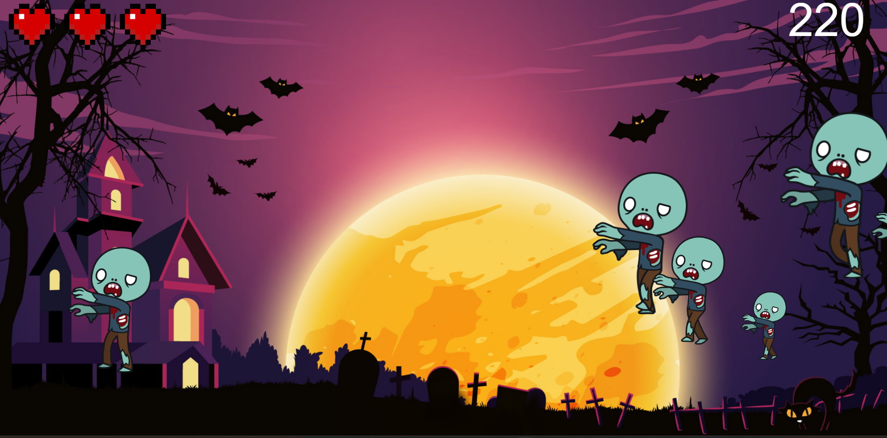

# Zombie Shooter - Web Game
## Author
- **[Filip Mokrzycki](https://github.com/Filipmok-agh)**

## Try it Yourself!  
Play the game online here: 👉 [Zombie Shooter](https://filipmok-agh.github.io/Zombie-shooter/zombie)

## Description
**Zombie Shooter** is a web-based game created using JavaScript and HTML5 Canvas. The game involves shooting randomly appearing zombies. The goal is to achieve the highest score by eliminating the oncoming zombies. The player has a limited number of lives, which are lost when zombies cross the screen.

The game is designed with responsiveness in mind, adapting to various screen resolutions.

## Technologies Used

The game was created using the following technologies:

- **HTML5 Canvas** - Used for rendering the game, including drawing the background, characters, UI elements (HUD), and animations.
- **JavaScript** - Implements the game logic, animations, and user interactions.
- **CSS** - Styles the game background and sets the custom cursor for clicks in the form of a crosshair.

## How to Play

- **Goal of the game**: The goal is to achieve the highest score by eliminating oncoming zombies. The player has 3 lives, which are lost when zombies pass the screen.
- **Controls**: The game is controlled by mouse clicks to shoot zombies. The mouse cursor is replaced with a crosshair image.
- **Restart**: After the game ends, clicking the "Play Again" button restarts a new round.

## Features

### Game Mechanics
1. **Zombie Spawning**: Zombies appear at random positions on the screen with varying speeds and sizes.
2. **Shooting**: The player clicks on zombies to eliminate them and earn points. Missing a shot results in a small score penalty.
3. **Difficulty**: Over time, the spawn rate of zombies increases, making the game more challenging.
4. **Life Loss**: The player loses a life if a zombie passes through the screen.
5. **Game Over**: The game ends when the player loses all lives.
6. **Score Display**: The current score and remaining lives are displayed on the screen.

### Audio
- **Background Music**: [Music](https://opengameart.org/content/8-bit-epic-space-shooter-music).
- **Shot sound**: [Sound](https://opengameart.org/content/light-machine-gun).
### Graphics
- **Zombie Animations**: Each zombie has its own walking animation.
- **Background**: The game features a background image that scales to the screen resolution.
- **Hearts**: Health is represented by heart icons, changing according to the number of remaining lives.
- **Cursor**: The mouse cursor is replaced with a custom crosshair image.

### User Interface
- **Health Bar**: The top of the screen shows heart icons indicating the player's remaining lives.
- **Score**: The current score is displayed at the top right corner of the screen.
- **"Play Again" Button**: After the game ends, a button is displayed allowing the player to restart the game.

## Example Screenshot

